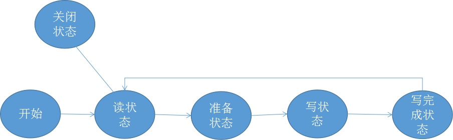

# 服务端模块
Blastoise的服务端模块负责接收用户发送过来的SQL语句，并把结果数据发送给客户端。Blastoise基于TCP设计了一种简单的应用层协议以处理数据分包的问题。在具体实现中，Blastoise使用了事件循环来处理网络收发数据，以提高瞬间的响应能力。之所以说是瞬间，因为服务端的响应能力终究是看对SQL语句的执行能力，因此即使网络处理得再快，处理请求的部分忙不过来也是没有用的，事件循环仅仅是为了提高服务端对网络的响应能力。

## 数据库的应用层协议
Blastoise的应用层协议设计力求简单而又能解决TCP流分包的问题。
### 请求包格式
请求包格式很简单，是一个SQL语句的字符串加一个\n换行符号。这里没有处理SQL语句的字符串字面量含\n的情况。
### 查询响应包格式
这里分为两种情况，一种是查询操作成功，另一种是查询失败。这里先说明成功的情况，错误的情况见下面。
  
首先查询操作得到的元组的元数据直接使用了一个json来表示，然后第一个字段是表名这个json字符串的长度，这个长度字段是一个四字节的大端无符号整型。json字符串后就是元组数据，接着以一个\r\n结束报文。
### 错误响应包格式
 
对于所有SQL语句的错误包格式都统一使用一种错误响应包格式，第一个字段是0以表明是错误，同样是四字节的大端无符号整型，接着是错误信息的字符串，然后以\r\n结束，这里不考虑错误信息的字符串中包含\r\n。
### 非查询操作的成功响应包格式
 
非查询操作的成功响应包第一个字段也是0，同样是四字节的大端无符号整型，接着以\r\n结尾。

## 处理请求的状态机
由于事件循环会把处理请求的逻辑分得很碎，因此Blastoise使用了一个状态机来管理网络请求。这些状态是读状态、准备状态、写状态、写完成状态、关闭状态。
  
读状态用于读取客户端发送过来的SQL语句，当发现\r\n后，就把状态转为预备状态，并把任务交给工作线程，工作线程开始生产结果数据后，就把状态转为写状态，写完后就转换为完成状态，接着又回到读状态。如果读状态中读到了0长度的数据，则表示客户端关闭TCP。服务端是不会主动关闭TCP连接的。
在写状态中，对写事件的监听是不会一直打开的，只有在写数据的时候才打开，写完后就注销事件的监听。而在转换到写结束状态时，会写一个\r\n以作为协议的结束符。

## 写缓冲区
在网络模块中，因为操作系统内核的socket缓冲区是有可能满的，如果在这个时候对这个缓冲区做写操作就会阻塞，因此一般都会再自建一个用户态的缓冲区，这样就可以随时把生产得到的数据写入这个缓冲区而不阻塞了。Blastoise也自建了一个缓冲区，这个缓冲区以一段连续的内存和两个指针来实现，一个指针指向未读数据的开始地址，另一个指针用来指向可写部分的开始地址，即未读数据的末尾。当第二个指针到内存末尾的空间不够用时，采取两种策略，当前后空位合起来够用时，未读数据前移，当不够时则重新申请更多的内存。
  

# 客户端
以上所有模块都用了Rust来实现，而为了开发效率客户端则使用了Python来实现。Blastoise使用了Python的cmd模块实现了一个shell。
