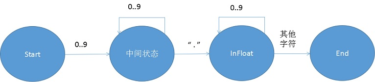
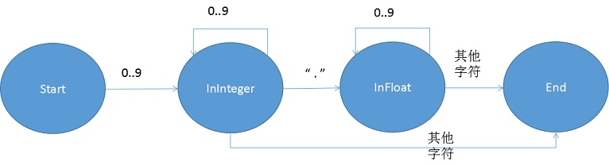
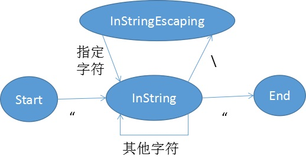
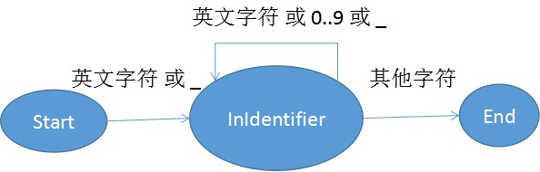

# SQL解析与语义检查

## 词法分析

用户输入的SQL语句作为字符串首先要被转换为单词(Token)串，这是词法分析的任务。在Blastoise中，单词的类型有整型数字、浮点型数字、字符串、标识符、关键字（如Select）。Blastoise参照了传统的词法分析方法，即用有限自动机来识别单词类型。对于不同的单词类型，使用不同的状态机来识别他们，但其中整型数字会跟浮点型数字合起来一起处理，标识符和关键字使用的是同一个状态机，在识别出一个标识符后，通过判断单词内容是不是关键字来决定要不要把这个单词归类为关键字。
最终，所有单词类型的状态机需要被合并到一起，来组成识别所有单词类型的大状态机。

### 整型与浮点型数字
通常整型和浮点型数字会被放在一起处理，我们将先单独看看单独处理整型和浮点型的状态机是怎么样的，再来解释为什么要把他们放到一起。  
  
整型状态机是非常简单的状态机，从起始状态如果遇到数字字符就进入InInteger状态，如果继续遇到数字字符，则停留在InInteger状态，如果遇到非数字字符就进入终结状态，并把这个这个过程中遇到的所有数字字符串截取下来，从而获得整型数字的单词。
  
浮点型状态机则复杂一点，首先需要有一串数字字符，然后是一个'.'字符，然后再是一串数字字符。这里有个问题，上面那个状态机对于“12.”这样的点后面没有数字的字符串，也会认为他是一个表示浮点型的单词。事实上，不少编程语言的规范中，也认为这样的字符串是合法的浮点型单词。然而Blastoise还是去掉了这种反直觉的情况。这样上面的状态机就需要把InFloat状态分裂成两个状态，在中间状态遇到点字符会进入InFloat1状态，InFloat1遇到数字字符会转到InFloat2状态，InFloat2状态遇到数字字符则停留，遇到其它字符则进入终结状态。在Blastoise中，采用了另一种更便捷的方法来规避这种把状态机弄复杂的做法。在程序中，当状态由中间状态变成InFloat状态时，会检查点字符后面的字符是否为数字字符，如果不是，则直接报错。这样的程序虽然不是一个很严格的有限自动机程序，因为它需要向后预先查看字符，但其实严格准守有限自动机并不会带来什么好处。

事实上通过观察整型状态机和浮点型状态机，我们很容易看出来，整型状态机完全可以嵌入到浮点型状态机中。  
  
这样，这个状态机就可以同时处理整型和浮点型。如果不这么做，在合并整型状态机和浮点型状态机的时候就会有问题。具体来说，在遇到一串数字字符的时候，就不知道当前状态应该是整型状态机的InInteger还是浮点型状态机的中间状态。这个时候要么提前向后搜点字符，要么在发现状态机错误的时候回溯，无论哪种都非常麻烦，因此合并整型和浮点型状态机是十分需要的。

### 字符串
字符串与其他单词一个很明显的不同是，单词两边的字符肯定是'"'。  
  
在遇到引号字符时，进入InString状态，再次遇到引号字符时，进入终结状态。值得注意的是，还需要处理转义字符。例如需要支持换行字符。这时需要增加多一个InStringEscaping的状态，如果遇到了反斜杠，则进入InStringEscaping状态，在这个状态中，如果遇到合法的转义字符，例如换行符n，则把两个\n字符转换为换行符，并转为InString状态。如果遇到非合法的转移字符则报错。

### 标识符
标识符是开头为英文字符或下划线的单词，它只能包含英文字符、下划线和数字。限制开头为英文字符和下划线，是为了在于合并状态机的时候，可以与整型-浮点型状态机区分开。
  

### 关键字
关键字可以使用标识符的状态机，然后在生成单词的时候，可以判断内容是否为关键字来把标识符转换成关键字。

## 语法分析

在词法分析阶段获得单词序列后，就需要将其转换为解析树。Blastoise使用了递归下降的自顶向下方法对SQL的单词串进行解析。由于SQL语句的文法大部分都是SLL(1)，因此解析这部分文法比较容易，下文对这部分将只以SELECT语句为例。而比较复杂的在于WHERE子句中的条件表达式的解析，下文将着重说明解析条件表达式所遇到的问题以及解决方法。在介绍解析SQL单词串前，本文先对递归下降作简要说明。

### 递归下降法
递归下降法作为一种简单有效的语法分析方法一直被广泛利用。因为一般解析程序往往不是软件系统的效率瓶颈，因此往往不需要考虑解析程序的性能问题。而递归下降的好处是易于实现且当文法有改动的时候，也可以很方便地修改程序以适应新文法。
递归下降最基本的思想是，使用一个指针指向单词串中的单词，指针一开始指向第一个单词。然后尝试去匹配文法。如果文法匹配成功则把指针向后移动，然后尝试匹配子文法，如果又能匹配成功就继续移动指针。如果文法匹配不成功则换其它文法尝试。当所有子文法都匹配完成时，如果指针恰好指向单词串的末端，则说明刚才的解析路径已经成功解析单词串，最终可得到解析树。如果此时还有其他单词串未被解析，则说明该路径是错误的，继续回溯，换其它文法尝试。

### SELECT语句的解析
SELECT语句的文法如下：
select_statement ::= SELECT select_expr
                     FROM relation_list
                     [WHERE condition]
                     [
                        GROUP BY table_attribute
                        [HAVING condition]
                     ]
                     [ORDER BY attribute]
解析SELECT语句时，一开始会识别SELECT这个关键字，如果第一个单词不是SELECT关键字，则会立即报错。之后会尝试识别 select_expr。识别完之后会找FROM关键字，之后是解析relation_list。对于接下来几个可选项，如果接下来的指针所指的单词是WHERE，则说明有WHERE子句，继续解析WHERE子句中的条件表达式。如果有GROUP BY则解析table_attribute，还有尝试查看是否有HAVING子句。最后尝试看看有没有ORDER BY子句。
明显可以看到，SELECT在设计的时候全都使用了SLL(1)文法，解析的时候只要简单看看后一个单词的类型，就可以知道接下来要怎么解析。更不需要像LL(1)那样去算FIRST集和FOLLOW集，大大降低了解析程序的复杂度。
但无可避免的是，WHERE子句中的条件表达式依然是使用了人们最常用的数学语言，而数学语言并不是简单的SLL(1)，而这部分的文法实现则复杂得多。

### 列表结构
在处理条件表达式之前，我们先对解析列表结构进行说明。因为该结构非常常见。这里所说的列表结构指“元素 分隔符 元素 分隔符 元素”这样的结构。它可以是更长的列表。分隔符往往都是一样的，而元素可以是多种多样的。拿SELECT语句中的select_expr来说，如果SELECT *的情况，select_expr就是一个表名列表，这个列表的分隔符是逗号，元素是标识符。我们将给出一个解析列表结构的通用方法。
在给出算法之前，先考虑两个个细节问题。首先是列表不能为空，这是递归下降锁要求的产生式右边不可以是空串。另外这也是SQL语句的语义所要求的，所有SQL的文法中不会有空的列表。另外，列表的结尾只能是元素，而不能是分隔符，这是我们的文法所要求的。
首先列表结构的文法是：
列表 ::= 元素 重复 | 元素  
重复 ::= 分隔符 元素 重复 | 分隔符 元素  
确实这也可以直接用递归下降的方法来解析，但这需要做回溯。事实上Blastoise用了一种更简便的方法来解析列表结构。这种做法首先解析第一个元素，然后提前看看后一个单词是什么类型，如果后面没有单词则成功返回，如果后面的单词不是分隔符，也成功返回，如果后面的单词是分隔符，则解析分隔符还有分隔符后面的元素，并将元素和分隔符加入到解析树。这种做法并不是严格的递归下降的做法，因为递归下降不会提前去看后一个单词。但实际上严格准守递归下降的做法也并没有什么好处，对递归下降稍作修改如果可以很好地解决问题也应该是鼓励的。加入提前向后看单词后，解析列表结构的程序将被大大简化而且变得更加紧凑。而且文法也可以变成这样：
列表 ::= 元素 [分隔符 元素]*
[]以内表示重复的内容，*表示重复0次以上。这虽然不是严格的文法写法，但却可以与上述解析算法相匹配，它可以很好地描述列表结构并大大简化问题并让问题变得更直观。
列表结构在SQL文法中多处出现，例如刚刚说到的select_expr，还有FROM子句中的relation_list，CREATE TABLE 中的属性定义，还有四则运算表达式中的连续加减乘除（这时分隔符就是四则运算符号）。

### 条件表达式
条件表达式是解析SQL语句中最复杂的一部分，在最复杂的情况下，条件表达式会被解析成一棵很深的解析树，它的元素包括各种类型的常量还有标识符。此外，条件表达式文法的设计还会牵涉到后面的语义检查，Blastoise使用了一种技巧通过调整文法从而减少一些类型检查。
