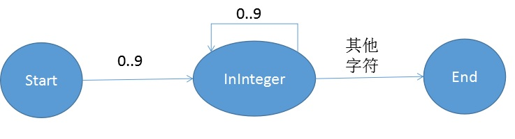

# SQL解析与语义检查

## 词法分析
用户输入的SQL语句作为字符串首先要被转换为单词(Token)串，这是词法分析的任务。在Blastoise中，单词的类型有整型数字、浮点型数字、字符串、标识符、关键字（如Select）。Blastoise参照了传统的词法分析方法，即用有限自动机来识别单词类型。对于不同的单词类型，使用不同的状态机来识别他们，但其中整型数字会跟浮点型数字合起来一起处理，标识符和关键字使用的是同一个状态机，在识别出一个标识符后，通过判断单词内容是不是关键字来决定要不要把这个单词归类为关键字。
最终，所有单词类型的状态机需要被合并到一起，来组成识别所有单词类型的大状态机。

### 整型与浮点型数字
通常整型和浮点型数字会被放在一起处理，我们将先单独看看单独处理整型和浮点型的状态机是怎么样的，再来解释为什么要把他们放到一起。  
  
整型状态机是非常简单的状态机，从起始状态如果遇到数字字符就进入InInteger状态，如果继续遇到数字字符，则停留在InInteger状态，如果遇到非数字字符就进入终结状态，并把这个这个过程中遇到的所有数字字符串截取下来，从而获得整型数字的单词。
  
浮点型状态机则复杂一点，首先需要有一串数字字符，然后是一个'.'字符，然后再是一串数字字符。这里有个问题，上面那个状态机对于“12.”这样的点后面没有数字的字符串，也会认为他是一个表示浮点型的单词。事实上，不少编程语言的规范中，也认为这样的字符串是合法的浮点型单词。然而Blastoise还是去掉了这种反直觉的情况。这样上面的状态机就需要把InFloat状态分裂成两个状态，在中间状态遇到点字符会进入InFloat1状态，InFloat1遇到数字字符会转到InFloat2状态，InFloat2状态遇到数字字符则停留，遇到其它字符则进入终结状态。在Blastoise中，采用了另一种更便捷的方法来规避这种把状态机弄复杂的做法。在程序中，当状态由中间状态变成InFloat状态时，会检查点字符后面的字符是否为数字字符，如果不是，则直接报错。这样的程序虽然不是一个很严格的有限自动机程序，因为它需要向后预先查看字符，但其实严格准守有限自动机并不会带来什么好处。

事实上通过观察整型状态机和浮点型状态机，我们很容易看出来，整型状态机完全可以嵌入到浮点型状态机中。  
  
这样，这个状态机就可以同时处理整型和浮点型。如果不这么做，在合并整型状态机和浮点型状态机的时候就会有问题。具体来说，在遇到一串数字字符的时候，就不知道当前状态应该是整型状态机的InInteger还是浮点型状态机的中间状态。这个时候要么提前向后搜点字符，要么在发现状态机错误的时候回溯，无论哪种都非常麻烦，因此合并整型和浮点型状态机是十分需要的。

### 字符串
字符串与其他单词一个很明显的不同是，单词两边的字符肯定是'"'。  
  
在遇到引号字符时，进入InString状态，再次遇到引号字符时，进入终结状态。值得注意的是，还需要处理转义字符。例如需要支持换行字符。这时需要增加多一个InStringEscaping的状态，如果遇到了反斜杠，则进入InStringEscaping状态，在这个状态中，如果遇到合法的转义字符，例如换行符n，则把两个\n字符转换为换行符，并转为InString状态。如果遇到非合法的转移字符则报错。

### 标识符
标识符是开头为英文字符或下划线的单词，它只能包含英文字符、下划线和数字。限制开头为英文字符和下划线，是为了在于合并状态机的时候，可以与整型-浮点型状态机区分开。
  

### 关键字
关键字可以使用标识符的状态机，然后在生成单词的时候，可以判断内容是否为关键字来把标识符转换成关键字。
