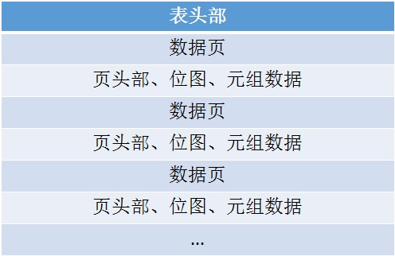

# 持久化

## 表信息的存储
表的信息本身也可以用关系型数据库来存储，方法是两张表，一张表存表名，另一张表存字段。虽然这种做法统一了数据的存储方法，但是取数据用的时候就略麻烦了。Blastoise直接采用了一个json文件来存表信息。

## 表数据的存储格式
Blastoise中，表的数据直接按一定的格式以一个文件存储在磁盘中，接下来将介绍表数据的存储格式。首先一个存储表数据的文件分为两部分，一部分是表的头部，存储了一些元信息。另一部分是一页一页的表数据，每页表数据内部也有自己一套存储格式。
  
Blastoise的表头部只有两个字段，一个是元组数据所占的页数，另外一个是第一个有空位可以用的页索引，用于插入操作时快速找到可用空位的位置。值得一提的是，虽然头部只有两个字段，但Blastoise还是用了一页的空间来存，一是为了避免之后的所有数据页的起始位置都不是按页大小来对齐。而事实上，页的起始地址只要按磁盘的逻辑块大小对齐就可以了，这里就不考虑这么细了。
在数据页内分三部分，一是头部，二是一副位图，三就是元组的数据。头部中包含了两个字段，一是页中可存放元组的总数，二是第一个元组空位的索引。第二部分的位图则用来标记哪些元组是有数据的，哪些是空位。第三部分的元组数据则是一个一个紧挨着放置。而一页存的元组数量都是根据表所有字段的大小算出来的，以充分利用整页的空间。
Blastoise支持三种数据，整型、浮点型、定长字符串。其中整型和浮点型都占四字节，而定长字符串则根据所指定的字符数，一个字符一个字节，如果不满四的倍数则用空白填满剩下的部分以达到4的倍数。

## 增删改查的实现
增删改查的操作由于都跟数据紧紧相关，尤其是增删改操作，每次操作完都要把数据持久化进磁盘，因此实际上增删改查操作的大部分实现都是写在持久化这个模块里面的。在实现上，分为几层。最外层的表管理负责对实现执行计划的迭代器暴露一些比较简单的接口。表管理下层是文件管理，表管理通过调用文件管理提供的接口来实现功能。文件管理就管理了数个文件对象，每个文件对象自身又管理数个数据页对象，数据页对象再去管理自己的位图表。
  
而实现的更多细节将放在后续对整个查询流程的介绍中。
