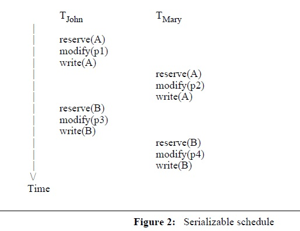
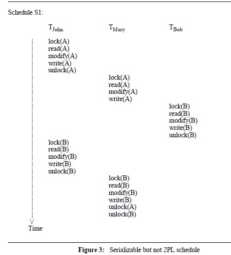
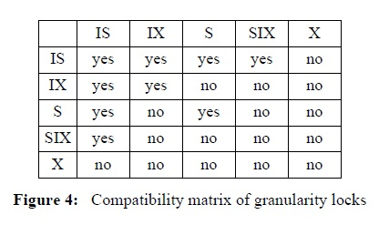
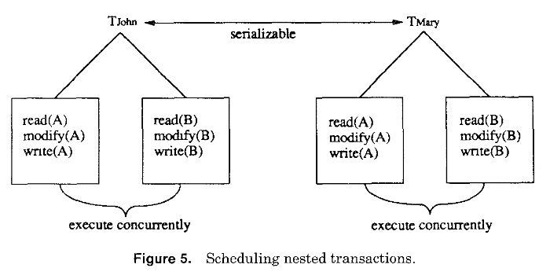

Concurrency Control in Advanced Database Applications

3 THE CONSISTENCY PROBLEM IN CONVENTIONAL DATABASE SYSTEMS
Database consistency is maintained if each data item in the database satisfies some
application-specific consistency constraints. For example, in a distributed airline reservation
system, one consistency constraint might be that each seat on a flight can be reserved by only
one passenger. It is often the case, however, that not all consistency constraints are known before
hand to the designers of general-purpose DBMSs, because of the lack of information about
the computations in potential applications.
Given the lack of knowledge about the application-specific semantics of database operations,
and the need to design general mechanisms that cut across many potential applications, the
best a DBMS can do is to abstract all operations on a database to be either a read operation or a
write operation, irrespective of the particular computation. Then it can guarantee that the
database is always in a consistent state with respect to reads and writes regardless of the semantics
of the particular application. Ignoring the possibility of bugs in the DBMS program and the
application program, inconsistent data then results from two main sources: (1) software or
hardware failures such as bugs in the operating system or a disk crash in the middle of operations,
and (2) concurrent access of the same data item by multiple users or programs.

3.1 The Transaction Concept
To solve these problems, the operations performed by a process that is accessing the
database are grouped into sequences called transactions [Eswaran et al. 76]. Thus, users would
interact with a DBMS by executing transactions. In traditional DBMSs, transactions serve three
distinct purposes [Lynch 83]: (1) they are logical units that group together operations that comprise
a complete task; (2) they are atomicity units whose execution preserves the consistency of
the database; and (3) they are recovery units that ensure that either all the steps enclosed within
them are executed, or none are. It is thus by definition that if the database is in a consistent state
before a transaction starts executing, it will be in a consistent state when the transaction terminates.
In a multi-user system, users execute their transactions concurrently, and the DBMS has to
provide a concurrency control mechanism to guarantee that consistency of data is maintained in
spite of concurrent accesses by different users. From the user’s viewpoint, a concurrency control
mechanism maintains the consistency of data if it can guarantee: (1) that each of the transactions
submitted to the DBMS by a user eventually gets executed; and (2) that the results of the computation
performed by each transaction are the same whether it is executed on a dedicated system
or concurrently with other transactions in a multi-programmed system [Bernstein et al. 87;
Papadimitriou 86].

Let us follow up on our previous example to demonstrate the concept of transactions. John
and Mary are assigned the task of fixing two bugs that were suspected to be in modules A and
B. The first bug is caused by an error in procedure p1 in module A, which is called by procedure
p3 in module B (thus fixing the bug might affect both p1 and p3). The second bug is caused by
an error in the interface of procedure p2 in module A, which is called by procedure p4 in B. John
and Mary agree that John will fix the first bug and Mary will fix the second. John starts a
transaction TJohn and proceeds to modify procedure p1 in module A. After completing the
modification, he starts modifying procedure p3 in module B. At the same time, Mary starts a
transaction TMary to modify procedure p2 in module A and procedure p4 in module B.
  
Although TJohn and TMary are executing concurrently, their outcomes are expected to be the
same, had each of them been executed on a dedicated system. The overlap between TMary and
TJohn results in a sequence of actions from both transactions, called a schedule. Figure 2 shows
an example of a schedule made up by interleaving operations from TJohn and TMary. A schedule
that gives each transaction a consistent view of the state of the database is considered a consistent
schedule. Consistent schedules are a result of synchronizing the concurrent operations of
users by allowing only those operations that maintain consistency to be interleaved.

3.2 Serializability
Let us give a more formal definition of a consistent schedule. Since transactions are consistency
preserving units, if a set of transactions T1, T2, ..., Tn are executed serially (i.e., for every
i= 1 to n-1, transaction Ti is executed to completion before transaction Ti+1 begins), consistency
is preserved. Thus, every serial execution (schedule) is correct by definition. We can then establish
that a serializable execution (one that is equivalent to a serial execution) is also correct.
From the perspective of a DBMS, all computations in a transaction either read or write a data
item from the database. Thus, two schedules S1 and S2 are said to be computationally equivalent
if [Korth and Silberschatz 86]:
1. The set of transactions that participate in S1 and S2 are the same.
2. For each data item Q in S1, if transaction Ti executes read(Q) and the value of Q
read by Ti is written by Tj, then the same will hold in S2 (i.e., read-write
synchronization).
3. For each data item Q in S1, if transaction Ti executes the last write(Q) instruction,
then the same holds also in S2 (i.e., write-write synchronization).
For example, the schedule shown in figure 2 is equivalent to the serial schedule TJohn,
TMary (execute TJohn to completion and then execute TMary) because: (1) the set of transactions
in both schedules are the same; (2) both data items A and B read by TMary are written by TJohn in
both schedules; and (3) TMary executes the last write(A) operation and the last write(B) operation
in both schedules.
The consistency problem in conventional database systems reduces to that of testing for
serializable schedules because it is accepted that the consistency constraints are unknown. Each
operation within a transaction is abstracted into either reading a data item or writing it. Achieving
serializability in DBMSs can thus be decomposed into two subproblems: read-write
synchronization and write-write synchronization, denoted rw and ww synchronization,
respectively [Bernstein and Goodman 81]. Accordingly, concurrency control algorithms can be
categorized into those that guarantee rw synchronization, those that are concerned with ww
synchronization, and those that integrate the two. Rw synchronization refers to serializing transactions
in such a way so that every read operation reads the same value of a data item as that it
would have read in a serial execution. Ww synchronization refers to serializing transactions so
that the last write operation of every transaction leaves the database in the same state as it would
have left it in some serial execution. Rw and ww synchronization together result in a consistent
schedule.
When more than one transaction is involved in reading and writing the same object at the
same time, one of the transactions is guaranteed to complete its task while other transactions
must be prevented from executing the conflicting operations until the continuing transaction is
complete and a consistent state is guaranteed. Thus, even though a DBMS may not have any
information about application-specific consistency constraints, it can guarantee consistency by
allowing only serializable executions of concurrent transactions. This concept of serializability
is central to all the concurrency control mechanisms described in the next section. If more
semantic information about transactions and their operations were available, schedules that are
not serializable but that do maintain consistency can be produced. That is exactly what the extended
transaction mechanisms discussed later try to achieve.

4 TRADITIONAL APPROACHES TO CONCURRENCY CONTROL
In order to understand why conventional concurrency control mechanisms are too restrictive
for advanced applications, it is necessary to be familiar with the basic ideas of the main
serializability-based concurrency control mechanisms that have been proposed for, and implemented
in, conventional database systems. Most of the mechanisms follow one of five main
approaches to concurrency control: two-phase locking, which is the most popular example of
locking protocols, timestamp ordering, optimistic concurrency control, multiversion concurrency,
and nested transactions, which is relatively orthogonal to the first four mechanisms. In
this section, we briefly describe these five approaches. For a comprehensive discussion and survey
of the topic, the reader is referred to [Bernstein and Goodman 81] and [Kohler 81].

4.1 Locking Mechanisms
4.1.1 Two-Phase Locking
The two-phase locking mechanism (2PL) introduced by Eswaran et al. is now accepted as
the standard solution to the concurrency control problem in conventional database systems. 2PL
guarantees serializability in a centralized database when transactions are executed concurrently.
The mechanism depends on well-formed transactions, which (1) do not relock entities that have
been locked earlier in the transaction, and (2) are divided into a growing phase, in which locks
are only acquired, and a shrinking phase, in which locks are only released [Eswaran et al. 76].
During the shrinking phase, a transaction is prohibited from acquiring locks. If a transaction
tries during its growing phase to acquire a lock that has already been acquired by another transaction,
it is forced to wait. This situation might result in deadlock if transactions are mutually
waiting for each other’s resources.
2PL allows only a subset of serializable schedules. In the absence of information about
how and when the data items are accessed, however, 2PL is both necessary and sufficient to
ensure serializability by locking [Yannakakis 82]. If we have prior knowledge about the order of
access of data items, which is often the case in advanced applications, we can construct locking
protocols that are not 2PL but ensure serializability. One such protocol is the tree protocol,
which can be applied if there is a partial ordering on the set of items that are accessed by concurrent
transactions. To illustrate this protocol, assume that a third programmer, Bob, joined the
programming team of Mary and John and is now working with them on the same project. Suppose
that Bob, Mary and John want to modify modules A and B concurrently in the manner
depicted in schedule S1 of figure 3. The tree protocol would allow this schedule to execute
because it is serializable (equivalent to TBob TJohn TMary) even though it does not follow the 2PL
protocol (because TJohn releases the lock on A before it acquires the lock on B). It is possible to
construct S1 because all of the transactions in the example access (write) A before B. This information
about the access patterns of the three transactions was used to construct the non-2PL
schedule shown in the figure. This example demonstrates why 2PL is in fact not appropriate for
advanced applications.
  

4.2 Timestamp Ordering
One of the problems of locking mechanisms is deadlock, which occurs when two or more
transactions are mutually waiting for each other’s resources. This problem can be solved by
assigning each transaction a unique number, called a timestamp, chosen from a monotonically
increasing sequence, which is often a function of the time of the day [Kohler 81]. Using timestamps,
a concurrency control mechanism can totally order requests from transactions according
to the transactions’ timestamps [Rosenkrantz et al. 78]. The mechanism forces a transaction requesting
to access a resource that is being held by another transaction to either (1) wait until the
other transaction that has hold of the requested resource at that time terminates, (2) abort itself
and restart if it cannot be granted the request, or (3) preempt the other transaction and get hold of
the resource. A scheduling protocol decides which one of these three actions to take after comparing
the timestamp of the requesting transaction with the timestamps of conflicting transactions.
The protocol must guarantee that a deadlock situation will not arise.
Two of the possible alternative scheduling protocols used by timestamp-based mechanisms
are: (1) the WAIT-DIE protocol, which forces a transaction to wait if it conflicts with a running
transaction whose timestamp is more recent, or to die (abort and restart) if the running
transaction’s timestamp is older; and (2) the WOUND-WAIT protocol, which allows a transaction
to wound (preempt by suspending) a running one with a more recent timestamp, or forces
the requesting transaction to wait otherwise. Locks are used implicitly in this technique since
some transactions are forced to wait as if they were locked out.

4.3 Multiversion Timestamp Ordering
The timestamp ordering mechanism above assumes that only one version of a data item
exists. Consequently, only one transaction can access a data item at a time. This mechanism can
be improved in the case of read-write synchronization by allowing multiple transient versions of
a data item to be read and written by different transactions, as long as each transaction sees a
consistent set of versions for all the data items that it accesses. This is the basic idea of the
multiversion scheme introduced by Reed [Reed 78]. In Reed’s mechanism, each transaction is
assigned a unique timestamp when it starts; all operations of the transaction are assigned the
same timestamp. For each data item x there is a set of read timestamps and a set of <write
timestamp, value> pairs, called transient versions.
The existence of multiple versions eliminates the need for write-write synchronization since
each write operation produces a new version and thus can not conflict with another write operation.
The only possible conflicts are those corresponding to read-from relationships [Bernstein et
al. 87], as demonstrated by the following example.
Let R(x) be a read operation with timestamp TS(R). R(x) is processed by reading the value
of the version of x whose timestamp is the largest timestamp smaller than TS(R). TS(r) is then
added to the set of read timestamps of item x. Similarly, let W(x) be a write operation that
assigns value v to item x, and let its timestamp be TS(W). Let interval(W) be the interval from
TS(W) to the smallest timestamp of a version of x greater than TS(W) (i.e., a version of x that
was written by another transaction whose timestamp is more recent than TS(W)). A situation
like this occurs because of delays in executing operations within a transaction (the write operation
might have been the last operation after many other operations in the same transaction).
Because of those delays, an operation Oi belonging to transaction Ti might be executed after Ti
had started by a period of time. In the meanwhile, other operations from a more recent transaction
might have been performed. If any read timestamps lies in the interval (i.e., a transaction
has already read a value of x written by a more recent write operation than W), then W is
rejected (and the transaction is aborted). Otherwise, W is allowed to create a new version of x.

4.4 Optimistic Non-Locking Mechanisms
In many applications, locking has been found to constrain concurrency and to add an unnecessary
overhead. The locking approach has the following disadvantages [Kung and Robinson
81]:
1. Lock maintenance represents an unnecessary overhead for read-only transactions,
which do not affect the integrity of the database.
2. Most of the general-purpose deadlock-free locking mechanisms work well only in
some cases but perform rather poorly in other cases. There are no locking
mechanisms that provide high concurrency in all cases.
3. When large parts of the database resides on secondary storage, locking of objects
that are accessed frequently (referred to as congested nodes), while waiting for
secondary memory access, causes a significant decrease in concurrency.
4. Not permitting locks to be unlocked until the end of the transaction, which although
not required is always done in practice to avoid cascaded aborts, decreases
concurrency.
5. Most of the time it is not necessary to use locking to guarantee consistency since
most transactions do not overlap; locking may be necessary only in the worst case.
To avoid these problems, Kung and Robinson presented the concept of "optimistic" concurrency
control by introducing two families of concurrency control mechanisms (serial validation
and parallel validation) that do not use locking. They require each transaction to consist of two
or three phases: a read phase, a validation phase and possibly a write phase. During the read
phase, all writes take place on local copies (also referred to as transient versions) of the records
to be written. Then, if it can be established during the validation phase that the changes the
transaction made will not cause loss of integrity, i.e., that they are serializable with respect to all
committed transactions, the local copies are made global and thus accessible to other transactions
in the write phase.
Validation is done by assigning each transaction a timestamp at the end of the read phase
and synchronizing using timestamp ordering. The correctness criteria used for validation are
based on the notion of serial equivalence. Any schedule produced by this technique ensures that
if transaction Ti has a timestamp less than the timestamp of transaction Tj then the schedule is
equivalent to the serial schedule Ti followed by Tj. This can be ensured if any one of the following
three conditions holds:
1. Ti completes its write phase before Tj starts its read phase.
2. The set of data items written by Ti does not intersect with the set of data items read
by Tj, and Ti completes its write phase before Tj starts its write phase.
3. The set of data items written by Ti does not intersect with the set of data items read
or written by Tj, and Ti completes its read phase before Tj completes its read phase.

Although optimistic concurrency control allows more concurrency under certain circumstances,
it decreases concurrency when the read and write sets of the concurrent transactions
overlap. For example, Kung and Robinson’s protocol would cause one of transactions in the
simple 2PL schedule in figure 2 to be rolled back and restarted. From the viewpoint of advanced
applications, the use of rollback as the main mechanism of achieving serializability is a serious
disadvantage. Since operations in advanced transactions are generally long-lived (e.g., compiling
a module), rolling them back and restarting them wastes all the work that these operations
did (the object code produced by compilation). The inappropriateness of rolling back a long
transaction in advanced applications is discussed further in section 5.

4.5 Multiple Granularity Locking
All the concurrency control protocols described so far operate on individual data items to
achieve synchronization of transactions. It is sometimes desirable, however, to able to access a
set of data items as a single unit, e.g., to effectively lock each item in the set in one operation
rather than having to lock each item individually. Gray et al. presented a multiple granularity
concurrency control protocol, which aims to minimize the number of locks used while accessing
sets of objects in a database [Gray et al. 75]. In their model, Gray et al. organize data items in a
tree where items of small granularity are nested within larger ones. Each non-leaf item
represents the data associated with its descendants. This is different from the tree protocol
presented above in that the nodes of the tree (or graph) do not represent the order of access of
individual data items but rather the organization of data objects. The root of the tree represents
the whole database. Transactions can lock nodes explicitly, which in turn locks descendants
implicitly. Two modes of locks were defined: exclusive and shared. An exclusive (X) lock
excludes any other transaction from accessing (reading or writing) the node; a shared (S) lock
permits other transaction to read the same node concurrently, but prevents any updating of the
node.
To determine whether to grant a transaction a lock on a node (given these two modes), the
transaction manager would have to follow the path from the root to the node to find out if any
other transaction has explicitly locked any of the ancestors of the node. This is clearly inefficient.
To solve this problem, a third kind of lock mode called intention lock mode was
introduced [Gray 78]. All the ancestors of a node must be locked in intention mode before an
explicit lock can be put on the node. In particular, nodes can be locked in five different modes.
A non-leaf node is locked in intention-shared (IS) mode to specify that descendant nodes will be
explicitly locked in shared (S) mode. Similarly, an intention-exclusive (IX) lock implies that
explicit locking is being done at a lower level in an exclusive (X) mode. A shared and intentionexclusive
(SIX) lock on a non-leaf node implies that the whole subtree rooted at the node is
being locked in shared mode, and that explicit locking will be done at a lower level with
exclusive-mode locks. A compatibility matrix for the five kinds of locks is defined as shown in
figure 4. The matrix is used to determine when to grant lock requests and when to deny them.
Finally, a multiple granularity protocol based on the compatibility matrix was defined as
follows:

1. Before requesting an S or IS lock on a node, all ancestor nodes of the requested
node must be held in IX or IS mode by the requester.
2. Before requesting an X, SIX or IX lock on a node, all ancestor nodes of the requested
node must be held in SIX or IX mode by the requester.
3. Locks should be released either at the end of the transaction (in any order) or in
leaf to root order. In particular, if locks are not held to the end of a transaction, it
should not hold a lock on a node after releasing its ancestors.
The multiple granularity protocol increases concurrency and decreases overhead especially
when there is a combination of short transactions with a few accesses and transactions that last
for a long time accessing a large number of objects such as audit transactions that access every
item in the database. The Orion object-oriented database system provides a concurrency control
mechanism based on the multi-granularity mechanism described above [Kim et al. 88; Garza and
Kim 88].

4.6 Nested Transactions
A transaction, as presented above, is a set of primitive atomic actions abstracted as read and
write operations. Each transaction is independent of other transactions. In practice, there is a
need to compose several transactions into one unit (i.e., one transaction) for two reasons: (1) to
provide modularity; and (2) to provide finer grained recovery. The recovery issue maybe the
more important one, but it is not addressed in detail here since the focus of this paper is on
concurrency control. The modularity problem is concerned with preserving serializability when
composing two or more transactions. One way to compose transactions is gluing together the
primitive actions of all the transactions by concatenating the transactions in order into one big
transaction. This preserves consistency but decreases concurrency because the resulting transaction
is really a serial ordering of the subtransactions. Interleaving the actions of the transactions
to provide concurrent behavior, on the other hand, can result in violation of serializability
and thus consistency. What is needed is to execute the composition of transactions as a transaction
in its own right, and to provide concurrency control within the transaction.
The idea of nested spheres of control, which is the origin of the nested transactions concept,
was first introduced by Davies [Davies 73] and expanded by Bjork [Bjork 73]. Reed presented a
comprehensive solution to the problem of composing transactions by formulating the concept of
nested transactions [Reed 78]. A nested transaction is a composition of a set of subtransactions;
each subtransaction can itself be a nested transaction. To other transactions, the top-level nested
transaction is visible and appears as a normal atomic transaction. Internally, however, subtransactions
are run concurrently and their actions are synchronized by an internal concurrency control
mechanism. The more important point is that subtransactions fail and can be restarted or
replaced by another subtransaction independently without causing the whole nested transaction
to fail or restart. In the case of gluing the actions of subtransactions together, on the other hand,
the failure of any action would cause the whole new composite transaction to fail. In Reed’s
design, timestamp ordering is used to synchronize the concurrent actions of subtransactions
within a nested transaction. Moss designed a nested transaction system that uses locking for
synchronization [Moss 85]. Moss’s design also manages nested transactions in a distributed system.

As far as concurrency is concerned, the nested transaction model presented above does not
change the meaning of transactions (in terms of being atomic) and it does not alter the concept of
serializability. The only advantage is performance improvement because of the possibility of
increasing concurrency at the subtransaction level, especially in a multiprocessor system. To
illustrate this, consider transactions TJohn and TMary of figure 2. We can construct each as a
nested transaction as shown in figure 5. Using Moss’s algorithm, the concurrent execution of
John’s transaction and Mary’s transaction will produce the same schedule presented in figure 2.
Within each transaction, however, the two subtransactions can be executed concurrently, improving
the overall performance.
It should be noted that combinations of optimistic concurrency control, multiversion objects,
and nested transactions is the basis for many of the concurrency control mechanisms
proposed for advanced database applications. To understand the reasons behind this, we have to
address how the nature of data and computations in advanced database applications imposes new
requirements on concurrency control. We explore these new requirements in the next section,
and then present several approaches that take these requirements into consideration in rest of the
paper.