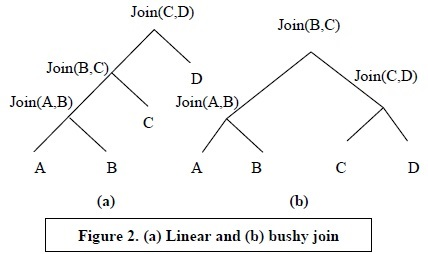
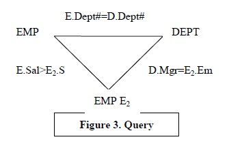
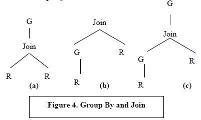

An Overview of Query Optimization in Relational Systems

&&&
关系型数据库查询优化概览
&&&

3. AN EXAMPLE: SYSTEM-R OPTIMIZER
&&&
3. 例子：SYSTEM-R的优化器
&&&
The System-R project significantly advanced the state of query
optimization of relational systems. The ideas in [55] have been
incorporated in many commercial optimizers continue to be
remarkably relevant. I will present a subset of those important
ideas here in the context of Select-Project-Join (SPJ) queries. The
class of SPJ queries is closely related to and encapsulates
conjunctive queries, which are widely studied in Database Theory.
The search space for the System-R optimizer in the context of a
SPJ query consists of operator trees that correspond to linear
sequence of join operations, e.g., the sequence
Join(Join(Join(A,B),C),D) is illustrated in Figure
2(a). Such sequences are logically equivalent because of
associative and commutative properties of joins. A join operator
can use either the nested loop or sort-merge implementation. Each
scan node can use either index scan (using a clustered or nonclustered
index) or sequential scan. Finally, predicates are
evaluated as early as possible.

&&&
System-R极大地推动了关系型数据库查询优化的研究。[55]中的的想法已经被用于很多商业的优化器。我这里会展示SPJ查询中的一部分重要的思想。SPJ与被数据库理论广泛研究的关联查询有很大的关系并且很好地总结了它。使用SPJ来说，System-R优化器中的的搜索空间由一些对应于一个连接序列的操作符树组成。例如，序列Join(Join(Join(A,B),C),D)可以用Fig2来表述。因为连接操作的结合性和交换性，这样的序列逻辑上与树相同。一个连接操作符可以用一个双层循环或者合并排序来实现。每个扫描结点可以使用索引扫描（使用聚合索引或非聚合索引）或者是顺序扫描。最后，断言被尽早地求值。
&&&
The cost model assigns an estimated cost to any partial or
complete plan in the search space. It also determines the estimated
size of the data stream for output of every operator in the plan. It
relies on:
&&&
耗费模型给出了搜索空间中部分或者整个执行计划的一个估算耗费。它同时决定了在执行计划中每个操作符的数据流的估算大小。它依赖于：
&&&
(a) A set of statistics maintained on relations and indexes, e.g.,
number of data pages in a relation, number of pages in an
index, number of distinct values in a column
&&&
(a)一组对于关系和索引的统计数据。例如关系中的数据页的数量，索引用到的数据页的数量，一列中不同的值的数量。
&&&
(b) Formulas to estimate selectivity of predicates and to project
the size of the output data stream for every operator node.
For example, the size of the output of a join is estimated by
taking the product of the sizes of the two relations and then
applying the joint selectivity of all applicable predicates.
&&&
(b)用于估计每个操作结点筛选率的断言和数据流投影大小的公式。例如，连接操作的输出规模是这样估计的，把两个做连接操作的关系的大小乘起来然后算上所有用到的断言的筛选率。
&&&
(c) Formulas to estimate the CPU and I/O costs of query
execution for every operator. These formulas take into
account the statistical properties of its input data streams,
existing access methods over the input data streams, and any
available order on the data stream (e.g., if a data stream is
ordered, then the cost of a sort-merge join on that stream may
be significantly reduced). In addition, it is also checked if the
output data stream will have any order.
&&&
(c)用于估计查询操作中每个操作符的CPU和IO耗费的公式。这些公式把输入流的统计特性、所有可用的的数据获取方法，还有数据流任何可用的顺序纳入估算中（例如，如果一个数据流是有序的，那么对这个数据流做归并排序的耗费就可以减少很多）。此外，输出流也会被检查是否具有有序性。
&&&
The cost model uses (a)-(c) to compute and associate the
following information in a bottom-up fashion for operators in a
plan: (1) The size of the data stream represented by the output of
the operator node. (2) Any ordering of tuples created or sustained
by the output data stream of the operator node. (3) Estimated
execution cost for the operator (and the cumulative cost of the
partial plan so far).
&&&
耗费模型使用了(a)-(c)以一种自底向上方法来计算执行计划中的操作符和结合下面列到的信息。(1)体现数据流大小的操作符输出数据流规模。(2)任何由一个操作符结点创建或者保持的输出元组有序性。(3)操作符的估算耗费（包括到这个到操作符位置累计的所有部分执行计划的耗费）。
&&&
The enumeration algorithm for System-R optimizer demonstrates
two important techniques: use of dynamic programming and use
of interesting orders.
&&&
System-R查询优化器中的遍历算法说明了两个重要的技术：动态规划的使用和期望的顺序。
&&&
The essence of the dynamic programming approach is based on
the assumption that the cost model satisfies the principle of
optimality. Specifically, it assumes that in order to obtain an
optimal plan for a SPJ query Q consisting of k joins, it suffices to
consider only the optimal plans for subexpressions of Q that
consist of (k-1) joins and extend those plans with an additional
join. In other words, the suboptimal plans for subexpressions of Q
(also called subqueries) consisting of (k-1) joins do not need to be
considered further in determining the optimal plan for Q.
Accordingly, the dynamic programming based enumeration views
a SPJ query Q as a set of relations {R1,..Rn} to be joined. The
enumeration algorithm proceeds bottom-up. At the end of the j-th
step, the algorithm produces the optimal plans for all subqueries
of size j. To obtain an optimal plan for a subquery consisting of
(j+1) relations, we consider all possible ways of constructing a
plan for the subquery by extending the plans constructed in the jth
step. For example, the optimal plan for {R1,R2,R3,R4} is
obtained by picking the plan with the cheapest cost from among
the optimal plans for: (1)Join({R1,R2,R3},R4) (2)
Join({R1,R2,R4},R3) (3) Join ({R1,R3,R4},R2) (4)
Join({R2,R3,R4}, R1). The rest of the plans for
{R1,R2,R3,R4} may be discarded. The dynamic programming
approach is significantly faster than the naïve approach since
instead of O(n!) plans, only O(n2n -1) plans need to be enumerated.
&&&
使用动态规划的本质是基于耗费模型符合优化性质的假设。更确切地说，它假设为了获取SPJ的一个最有的执行计划，这样一个执行计划Q由k个连接符组成，它可以先知考虑所有Q的只有k-1个连接符的子表达式，然后在此基础上扩展多一个连接符。换句话来说，Q子表达式（或者说子查询）的只有k-1个连接符的最优子计划对于Q的整体最优解来说就不用继续考虑。由此，基于动态规划的遍历视一个SPJ查询Q为一组将要被连接的关系{R1,..Rn}。遍历算法自底向上运行。在第j步结束的时候，算法计算除了所有规模为j的子查询的最优解。为了得到涵盖了j+1关系的子查询的最优解，我们考虑所有利用在j步计算出来的子最优解能够组合构造出来的情况。例如对于{R1,R2,R3,R4}的最优解，是在(1)Join({R1,R2,R3},R4) (2)Join({R1,R2,R4},R3) (3) Join ({R1,R3,R4},R2) (4)Join({R2,R3,R4}, R1)中挑选。其余的对于{R1,R2,R3,R4}的执行计划都会被删掉。动态规划比最基础的方法要高效很多，因为遍历的复杂度由O(n!)变成了O(n2n -1)。
&&&
The second important aspect of System R optimizer is the
consideration of interesting orders. Let us now consider a query
that represents the join among {R1,R2,R3} with the predicates
R1.a = R2.a = R3.a. Let us also assume that the cost of the
plans for the subquery {R1,R2} are x and y for nested-loop and
sort-merge join respectively and x < y. In such a case, while
considering the plan for {R1, R2, R3}, we will not consider the
plan where R1 and R2 are joined using sort-merge. However, note
that if sort-merge is used to join R1 and R2, the result of the join is
sorted on a. The sorted order may significantly reduce the cost of
the join with R3. Thus, pruning the plan that represents the sortmerge
&&&
System R优化器第二个重要的方面是期望顺序的考虑。让我们现在考虑这样的查询，{R1,R2,R3}做连接操作然后断言R1.a = R2.a = R3.a。让我们再假设子查询{R1,R2}的耗费对于使用内层循环是归并排序的复杂度分别是x和y，并且x<y。在这种情况，在考虑{R1, R2, R3}整个查询计划的时候，我们不会考虑对R1和R2做归并操作。然而，注意如果R1和R2座归并操作，连接之后的记过就是以字段a来排好序的。这个有序性可能会显著减低跟R3连接操作的耗费。因此，修剪掉表示归并排序的执行计划会导致R1和R2对于全局最优来说的子最优。
&&&
join between R1 and R2 can result in sub-optimality of the
global plan. The problem arises because the result of the sortmerge
join between R1 and R2 has an ordering of tuples in the
output stream that is useful in the subsequent join. However, the
nested-loop join does not have such ordering. Therefore, given a
query, System R identified ordering of tuples that are potentially
consequential to execution plans for the query (hence the name
interesting orders). Furthermore, in the System R optimizer, two
plans are compared only if they represent the same expression as
well as have the same interesting order. The idea of interesting
&&&
问题出现时因为对R1和R2做归并连接的结果顺序在接下来的连接操作中会非常有用。然而，内存循环实现的连接就没有这样的有序性。System R会查出可能会被执行计划用到的有序性（因此是期望顺序这个名字）。此外，在System R优化器中，当两个执行计划同时表示相同表达式和期望顺序时才会被比较。
&&&
order was later generalized to physical properties in [22] and is
used extensively in modern optimizers. Intuitively, a physical
property is any characteristic of a plan that is not shared by all
plans for the same logical expression, but can impact the cost of
subsequent operations. Finally, note that the System-R’s approach
of taking into account physical properties demonstrates a simple
mechanism to handle any violation of the principle of optimality,
not necessarily arising only from physical properties.
Despite the elegance of the System-R approach, the framework
cannot be easily extended to incorporate other logical
transformations (beyond join ordering) that expand the search
space. This led to the development of more extensible
optimization architectures. However, the use of cost-based
optimization, dynamic programming and interesting orders
strongly influenced subsequent developments in optimization.
&&&
期望顺序的思想后面在[22]中被一般化为一个物理属性并被现代优化器广泛使用。直觉上来说，一个物理属性是任何一个计划跟其它具有同等逻辑表达式的特性，并且这个特性会影响到接下来的操作耗费的。最后，注意System R提供了一种简单的机制来把违反最有型原理纳入考虑，不只是用于物理属性。除了System R方法的优雅性，这个框架不能很容易地扩折来跟其它扩展了搜索空间的逻辑变换（在连接有序以外）集成在一起。这导致了更可扩展的优化架构的开发。然而，基于耗费的优化、动态规划和期望顺序都极强地影响了接下来优化工作的发展。
&&&

4. SEARCH SPACE
&&&
4. 搜索空间
&&&
As mentioned in Section 2, the search space for optimization
depends on the set of algebraic transformations that preserve
equivalence and the set of physical operators supported in an
optimizer. In this section, I will discuss a few of the many
important algebraic transformations that have been discovered. It
should be noted that transformations do not necessarily reduce
cost and therefore must be applied in a cost-based manner by the
enumeration algorithm to ensure a positive benefit.
&&&
在第二节中提到，优化中的搜索中间依赖于一组转换定律保证了一组优化器支持的运算符在语义上的一致。在这一届，我会讨论一些很重要的已经被发现的转换定律。需要注意的是这些转换定律不一定会降低消耗因此必须要用基于耗费的遍历算法来保证它们是有用的。
&&&
The optimizer may use several representations of a query during
the lifecycle of optimizing a query. The initial representation is
often the parse tree of the query and the final representation is an
operator tree. An intermediate representation that is also used is
that of logical operator trees (also called query trees) that captures
an algebraic expression. Figure 2 is an example of a query tree.
Often, nodes of the query trees are annotated with additional
information.
&&&
优化器可能会在一个查询的不同优化的生命周期使用不同的表示。一开始的表示一般是查询的解析树还有最后的表示是有一个运算符树。一种描述数学表达式的逻辑运算符树（也叫做查询树）的中间表示同样会被用到。Fig2就是一个查询树的例子。一般查询书的结点还会被标记额外的信息。
&&&

Some systems also use a “calculus-oriented” representation for
analyzing the structure of the query. For SPJ queries, such a
structure is often captured by a query graph where nodes
represent relations (correlation variables) and labeled edges
represent join predicates among the relations (see Figure 3).
Although conceptually simple, such a representation falls short of
representing the structure of arbitrary SQL statements in a number
of ways. First, predicate graphs only represent a set of join
predicates and cannot represent other algebraic operators, e.g.,
union. Next, unlike natural join, operators such as outerjoin are
asymmetric and are sensitive to the order of evaluation. Finally,
such a representation does not capture the fact that SQL
statements may have nested query blocks. In the QGM structure
used in the Starburst system [26], the building block is an
enhanced query graph that is able to represent a simple SQL
statement that has no nesting (“single block” query). Multi block
queries are represented as a set of subgraphs with edges among
subgraphs that represent predicates (and quantifiers) across query
blocks. In contrast, Exodus [22] and its derivatives, uniformly use
query trees and operator trees for all phases of optimization.

&&&
有些系统同时使用了一种“面向计算”的表示来分析查询的结构。对于SPJ查询，这样的结构一般会被表示成一个查询图，其中结点表示关系（关联变量）还有带标签的边来表示对于关系的连接断言（见Fig3）。尽管概念上很简单，这样的表示在一些方面会不能表达任意的SQL语句。首先，断言图只能表达一组连接断言而不能表达其他操作符，例如并操作。然后，不像自然连接，操作符例如外连接是费堆成的然后也对执行顺序敏感。最后，这样的表示不能表达含有子查询块的SSQL语句。在用于Starburst系统的QGM结构，构建块是一个改良的查询图，并且能够表示一个简单的没有子查询的查询语句。多块的查询是以一组子图加上用于子图的表来表示对于多个查询块的断言。比较起来，Exodus还有它的变体对所有阶段的优化统一地使用了查询书还有运算符树
&&&

4.1 Commuting Between Operators
&&&
4.1 运算符的交换
&&&
A large and important class of transformations exploits
commutativity among operators. In this section, we see examples
of such transformations.
&&&
不少重要的操作符变换利用了运算符的交换律。在这一节，我们会看一些这些变换的例子。
&&&
4.1.1 Generalizing Join Sequencing
&&&
4.1.1 一般化连接操作序列
&&&
In many of the systems, the sequence of join operations is
syntactically restricted to limit search space. For example, in the
System R project, only linear sequences of join operations are
considered and Cartesian product among relations is deferred until
after all the joins.
&&&
在很多系统中，连接操作的序列在语义上被限制来限制搜索空间。例如，在System R，只会考虑线性的连接操作，并且对关系的笛卡尔积会被延迟到所有的连接之后。
&&&
Since join operations are commutative and associative, the
sequence of joins in an operator tree need not be linear. In
particular, the query consisting of join among relations
R1,R2,R3,R4 can be algebraically represented and evaluated as
Join(Join(A,B),Join(C,D)). Such query trees are called
bushy, illustrated in Figure 2(b). Bushy join sequences require
materialization of intermediate relations. While bushy trees may
result in cheaper query plan, they expand the cost of enumerating
the search space considerably1. Although there has been some
studies of merits of exploring the bushy join sequences, by and
large most systems still focus on linear join sequences and only
restricted subsets of bushy join trees.
&&&
因为连接操作是可交换和可结合的，操作符树的连接序列不一定要是线性的。例如，对于关系R1,R2,R3,R4的表示和求值可以是Join(Join(A,B),Join(C,D))。这样的查询书被叫做树形的，可见Fig2。树形的连接序列需要物化和中间表。树形的运算符树可能会得到一个搞笑的执行计划，它们也把遍历搜索空间的花费变大。尽管已经有一些树形连接序列的研究，大部分系统仍然只考虑线性连接序列还有一些树形连接树的子集。
&&&

Deferring Cartesian products may also result in poor performance.
In many decision-support queries where the query graph forms a
star, it has been observed that a Cartesian product among
appropriate nodes (“dimensional” tables in OLAP terminology
[7]) results in a significant reduction in cost.
In an extensible system, the behavior of the join enumerator may
be adapted on a per query basis so as to restrict the “bushy”-ness
of the join trees and to allow or disallow Cartesian products [46].
However, it is nontrivial to determine a priori the effects of such
tuning on the quality and cost of the search.
&&&
延迟笛卡尔积可能会导致很差的性能。在很多决策支持查询中，查询图会形成一个星型，人们已经观察到一个对于适当数量结点做的笛卡尔积（用OLAP术语“维度化”的表）会导致耗费的大量减少。在一个可扩展系统中，连接遍历器的性能可以适应于每个查询，这样就能限制树形的连接树，并且可以允许和不徐云笛卡尔积。然后，根据搜索的质量和耗费来决定这种开关还是不那么容易做的。
&&&

4.1.2 Outerjoin and Join
&&&
4.1.2 外连接和连接
&&&
One-sided outerjoin is an asymmetric operator in SQL that
preserves all of the tuples of one relation. Symmetric outerjoins
preserve both the operand relations. Thus, (R LOJ S), where LOJ
designates left outerjoin between R and S, preserves all tuples of
R. In addition to the tuples from natural join, the above operation
contains all remaining tuples in R that fail to join with S (padded
with NULLs for their S attributes). Unlike natural joins, a
sequence of outerjoins and joins do not freely commute. However,
when the join predicate is between (R,S) and the outerjoin
predicate is between (S,T), the following identity holds:
Join(R, S LOJ T) = Join (R,S) LOJ T
If the above associative rule can be repeatedly applied, we obtain
an equivalent expression where evaluation of the “block of joins”
precedes the “block of outerjoins”. Subsequently, the joins may be
freely reordered among themselves. As with other
transformations, use of this identity needs to be cost-based. The
identities in [53] define a class of queries where joins and
outerjoins may be reordered.
&&&
单边的外连接是SQL中一种非对称的操作符，它会保留一个关系中的所有元组。队员的外连接保留了作为操作数的关系的所有元组。因此(R LOJ S)，这里LOJ是做外链接，保留了R的所有元组。在自然连接得到的元组的基础上，上面的操作包括了所有的R那些被过滤掉的元组（S的属性都变成是NULL）。不像自然连接一组外连接和自然连接不能随意地交换。然而，当如果对于(R,S)的外连接的断言是基于(S,T)的，下面的等式就会成立：
Join(R, S LOJ T) = Join (R,S) LOJ T
如果上面的结合律能够重复使用，我们得到了一个具有相同语义的表达式，这个表达式会在做所有外连接之前做完所有的连接。对于前面那部分，连接就可以很自由地重新排序了。就像其他变换一样，需用这些变化必须基于耗费。在[53]的等式定义了一组查询，这写查询里面，连接和外连接可以重排序。
&&&

4.1.3 Group-By and Join

In traditional execution of a SPJ query with group-by, the
evaluation of the SPJ component of the query precedes the groupby.
The set of transformations described in this section enable the
group by operation to precede a join. These transformations are
applicable to queries with SELECT DISTINCT since the latter is
a special case of group-by. Evaluation of a group-by operator can
potentially result in a significant reduction in the number of
tuples, since only one tuple is generated for every partition of the
relation induced by the group-by operator. Therefore, in some
cases, by first doing the group-by, the cost of the join may be
significantly reduced. Moreover, in the presence of an appropriate
index, a group-by operation may be evaluated inexpensively. A
dual of such transformations corresponds to the case where a
group-by operator may be pulled up past a join. These
transformations are described in [5,60,25,6] (see [4] for an
overview).
In this section, we briefly discuss specific instances where the
transformation to do an early group-by prior to the join may be
applicable. Consider the query tree in Figure 4(a). Let the join
between R1 and R2 be a foreign key join and let the aggregated
columns of G be from columns in R1 and the set of group-by
columns be a superset of the foreign key columns of R1. For such
a query, let us consider the corresponding operator tree in Fig.
4(b), where G1=G. In that tree, the final join with R2 can only
eliminate a set of potential partitions of R1 created by G1 but will
not affect the partitions nor the aggregates computed for the
partitions by G1 since every tuple in R1 will join with at most one
tuple in R2. Therefore, we can push down the group-by, as shown
in Fig. 4(b) and preserve equivalence for arbitrary side-effect free
aggregate functions. Fig. 4(c) illustrates an example where the
transformation introduces a group-by and represents a class of
useful examples where the group-by operation is done in stages.
For example, assume that in Fig. 4(a), where all the columns on
which aggregated functions are applied are from R1. In these
cases, the introduced group-by operator G1 partitions the relation
on the projection columns of the R1 node and computes the
aggregated values on those partitions. However, the true partitions
in Fig 4(a) may need to combine multiple partitions introduced by
G1 into a single partition (many to one mapping). The group-by
operator G ensures the above. Such staged computation may still
be useful in reducing the cost of the join because of the data
reduction effect of G1. Such staged aggregation requires the
aggregating function to satisfy the property that Agg(S U S’)
can be computed from Agg(S) and Agg(S’). For example, in
order to compute total sales for all products in each division, we
can use the transformation in Fig. 4(c) to do an early aggregation
and obtain the total sales for each product. We then need a
subsequent group-by that sums over all products that belong to
each division.

4.2 Reducing Multi-Block Queries to Single-
Block
The technique described in this section shows how under some
conditions, it is possible to collapse a multi-block SQL query into
a single block SQL query.
4.2.1 Merging Views
Let us consider a conjunctive query using SELECT ANY. If one
or more relations in the query are views, but each is defined
through a conjunctive query, then the view definitions can simply
be “unfolded” to obtain a single block SQL query. For example, if
a query Q = Join(R,V) and view V = Join(S,T), then the
query Q can be unfolded to Join(R,Join(S,T)) and may be
freely reordered. Such a step may require some renaming of the
variables in the view definitions.
Unfortunately, this simple unfolding fails to work when the views
are more complex than simple SPJ queries. When one or more of
the views contain SELECT DISTINCT, transformations to move
or pull up DISTINCT need to be careful to preserve the number
of duplicates correctly, [49]. More generally, when the view
contains a group by operator, unfolding requires the ability to
pull-up the group-by operator and then to freely reorder not only
the joins but also the group-by operator to ensure optimality. In
particular, we are given a query such as the one in Fig. 4(b) and
we are trying to consider how we can transform it in a form such
as Fig. 4(a) so that R1 and R2 may be freely reordered. While the
transformations in Section 4.1.3 may be used in such cases, it
underscores the complexity of the problem [6].

4.2.2 Merging Nested Subqueries
Consider the following example of a nested query from [13]
where Emp# and Dept# are keys of the corresponding relations:
SELECT Emp.Name
FROM Emp
WHERE Emp.Dept# IN
SELECT Dept.Dept# FROM Dept
WHERE Dept.Loc=‘Denver’
AND Emp.Emp# = Dept.Mgr
If tuple iteration semantics are used to answer the query, then the
inner query is evaluated for each tuple of the Dept relation once.
An obvious optimization applies when the inner query block
contains no variables from the outer query block (uncorrelated).
In such cases, the inner query block needs to be evaluated only
once. However, when there is indeed a variable from the outer
block, we say that the query blocks are correlated. For example,
in the query above, Emp.Emp# acts as the correlated variable.
Kim [35] and subsequently others [16,13,44] have identified
techniques to unnest a correlated nested SQL query and “flatten”
it to a single query. For example, the above nested query reduces
to: SELECT E.Name
FROM Emp E, Dept D
WHERE E.Dept# = D.Dept#
AND D.Loc = ‘Denver’ AND E.Emp# = D.Mgr
Dayal [13] was the first to offer an algebraic view of unnesting.
The complexity of the problem depends on the structure of the
nesting, i.e., whether the nested subquery has quantifiers (e.g.,
ALL, EXISTS), aggregates or neither. In the simplest case, of
which the above query is an example, [13] observed that the tuple
semantics can be modeled as Semijoin(Emp,Dept,
Emp.Dept# = Dept.Dept#)2. Once viewed this way, it is
not hard to see why the query may be merged since:
Semijoin(Emp,Dept,Emp.Dept# = Dept. Dept#) =
Project(Join(Emp,Dept), Emp.*)
Where Join(Emp,Dept) is on the predicate Emp.Dept# =
Dept. Dept# . The second argument of the Project operator3
indicates that all columns of the relation Emp must be retained.
The problem is more complex when aggregates are present in the
nested subquery, as in the example below from [44] since merging
query blocks now requires pulling up the aggregation without
violating the semantics of the nested query:
SELECT Dept.name
FROM Dept
WHERE Dept.num-of-machines ≥
(SELECT COUNT(Emp.*) FROM Emp
WHERE Dept.name= Emp.Dept_name)
It is especially tricky to preserve duplicates and nulls. To
appreciate the subtlety, observe that if for a specific value of
Dept.name (say d), there are no tuples with a matching
Emp.Dept_name, i.e., even if the predicate Dept.name=
Emp.dept_name fails, then there is still an output tuple for the
Dept tuple d. However, if we were to adopt the transformation
used in the first query of this section, then there will be no output
tuple for the dept d since the join predicate fails. Therefore, in
the presence of aggregation, we must preserve all the tuples of the
outer query block by a left outerjoin. In particular, the above
query can be correctly transformed to:
SELECT Dept.name FROM Dept LEFT OUTER JOIN Emp
ON (Dept.name= Emp.dept_name )
GROUP BY Dept.name
HAVING Dept. num-of-machines < COUNT (Emp.*)
Thus, for this class of queries the merged single block query has
outerjoins. If the nesting structure among query blocks is linear,
then this approach is applicable and transformations produce a
single block query that consists of a linear sequence of joins and
outerjoins. It turns out that the sequence of joins and outerjoins is
such that we can use the associative rule described in Section
4.1.2 to compute all the joins first and then do all the outerjoins in
sequence. Another approach to unnesting subqueries is to
transform a query into one that uses table-expressions or views
(and therefore, not a single block query). This was the direction of
Kim’s work [35] and it was subsequently refined in [44].

4.3 Using Semijoin Like Techniques for
Optimizing Multi-Block Queries
In the previous section, I presented examples of how multi-block
queries may be collapsed in a single block. In this section, I
discuss a complementary approach. The goal of the approach
described in this section is to exploit the selectivity of predicates
across blocks.4 It is conceptually similar to the idea of using
semijoin to propagate from a site A to a remote site B information
on relevant values of A so that B sends to A no unnecessary
tuples. In the context of multi-block queries, A and B are in
different query blocks but are parts of the same query and
therefore the transmission cost is not an issue. Rather, the
information “received from A” is used to reduce the computation
needed in B as well as to ensure that the results produced by B are
relevant to A as well. This technique requires introducing new
table expressions and views. For example, consider the following
query from [56]:
CREATE VIEW DepAvgSal As (
SELECT E.did, Avg(E.Sal) AS avgsal
FROM Emp E
GROUP BY E.did)
SELECT E.eid, E.sal
FROM Emp E, Dept D, DepAvgSal V
WHERE E.did = D.did AND E.did = V.did
AND E.age < 30 AND D.budget > 100k
AND E.sal > V.avgsal
The technique recognizes that we can create the set of relevant
E.did by doing only the join between E and D in the above
query and projecting the unique E.did. This set can be passed to
the view DepAvgSal to restrict its computation. This is
accomplished by the following three views.
CREATE VIEW partialresult AS
(SELECT E.id, E.sal, E.did
FROM Emp E, Dept D
WHERE E.did=D.did AND E.age < 30
AND D.budget > 100k)
CREATE VIEW Filter AS
(SELECT DISTINCT P.did FROM PartialResult P)
CREATE VIEW LimitedAvgSal AS
(SELECT E.did, Avg(E.Sal) AS avgsal
FROM Emp E, Filter F
WHERE E.did = F.did GROUP BY E.did)
The reformulated query on the next page exploits the above views
to restrict computation.
SELECT P.eid, P.sal
FROM PartialResult P, LimitedDepAvgSal V
WHERE P.did = V.did AND P.sal > V.avgsal
The above technique can be used in a multi-block query
containing view (including recursive view) definitions or nested
subqueries [42,43,56,57]. In each case, the goal is to avoid
redundant computation in the views or the nested subqueries. It is
also important to recognize the tradeoff between the cost of
computing the views (the view PartialResult in the example
above) and use of such views to reduce the cost of computation.
The formal relationship of the above transformation to semijoin
has recently been presented in [56] and may form the basis for
integration of this strategy in a cost-based optimizer. Note that a
degenerate application of this technique is passing the predicates
across query blocks instead of results of views. This simpler
technique has been used in distributed and heterogeneous
databases and generalized in [36].

5. STATISTICS AND COST ESTIMATION
Given a query, there are many logically equivalent algebraic
expressions and for each of the expressions, there are many ways
to implement them as operators. Even if we ignore the
computational complexity of enumerating the space of
possibilities, there remains the question of deciding which of the
operator trees consumes the least resources. Resources may be
CPU time, I/O cost, memory, communication bandwidth, or a
combination of these. Therefore, given an operator tree (partial or
complete) of a query, being able to accurately and efficiently
evaluate its cost is of fundamental importance. The cost
estimation must be accurate because optimization is only as good
as its cost estimates. Cost estimation must be efficient since it is
in the inner loop of query optimization and is repeatedly invoked.
The basic estimation framework is derived from the System-R
approach:
1. Collect statistical summaries of data that has been stored.
2. Given an operator and the statistical summary for each of its
input data streams, determine the:
(a) Statistical summary of the output data stream
(b) Estimated cost of executing the operation
Step 2 can be applied iteratively to an operator tree of arbitrary
depth to derive the costs for each of its operators. Once we have
the costs for each of the operator nodes, the cost for the plan may
be obtained by combining the costs of each of the operator nodes
in the tree. In Section 5.1, we discuss the statistical parameters
for the stored data that are used in cost optimization and efficient
ways of obtaining such statistical information. We also discuss
how to propagate such statistical information. The issue of
estimating cost for physical operators is discussed in Section 5.2.
It is important to recognize the differences between the nature of
the statistical property and the cost of a plan. The statistical
property of the output data stream of a plan is the same as that of
any other plan for the same query, but its cost can be different
from other plans. In other words, statistical summary is a logical
property but the cost of a plan is a physical property.

5.1 Statistical Summaries of Data
5.1.1 Statistical Information on Base Data
For every table, the necessary statistical information includes the
number of tuples in a data stream since this parameter determines
the cost of data scans, joins, and their memory requirements. In
addition to the number of tuples, the number of physical pages
used by the table is important. Statistical information on columns
of the data stream is of interest since these statistics can be used to
estimate the selectivity of predicates on that column. Such
information is created for columns on which there are one or more
indexes, although it may be created on demand for any other
column as well.

In a large number of systems, information on the data distribution
on a column is provided by histograms. A histogram divides the
values on a column into k buckets. In many cases, k is a constant
and determines the degree of accuracy of the histogram. However,
k also determines the memory usage, since while optimizing a
query, relevant columns of the histogram are loaded in memory.
There are several choices for “bucketization” of values. In many
database systems, equi-depth (also called equi-height) histograms
are used to represent the data distribution on a column. If the table
has n records and the histogram has k buckets, then an equi-depth
histogram divides the set of values on that column into k ranges
such that each range has the same number of values, i.e., n/k.
Compressed histograms place frequently occurring values in
singleton buckets. The number of such singleton buckets may be
tuned. It has been shown in [52] that such histograms are effective
for either high or low skew data. One aspect of histograms
relevant to optimization is the assumption made about values
within a bucket. For example, in an equi-depth histogram, values
within the endpoints of a bucket may be assumed to occur with
uniform spread. A discussion of the above assumption as well as a
broad taxonomy of histograms and ramifications of the histogram
structures on accuracy appears in [52]. In the absence of
histograms, information such as the min and max of the values in
a column may be used. However, in practice, the second lowest
and the second highest values are used since the min and max
have a high probability of being outlying values. Histogram
information is complemented by information on parameters such
as number of distinct values on that column
Although histograms provide information on a single column,
they do not provide information on the correlations among
columns. In order to capture correlations, we need the joint
distribution of values. One option is to consider 2-dimensional
histograms [45,51]. Unfortunately, the space of possibilities is
quite large. In many systems, instead of providing detailed joint
distribution, only summary information such as the number of
distinct pairs of values is used. For example, the statistical
information associated with a multi-column index may consist of
a histogram on the leading column and the total count of distinct
combinations of column values present in the data.

5.1.2 Estimating Statistics on Base Data
Enterprise class databases often have large schema and also have
large volumes of data. Therefore, to have the flexibility of
obtaining statistics to improve accuracy, it is important to be able
to estimate the statistical parameters accurately and efficiently.
Sampling data provides one possible approach. However, the
challenge is to limit the error in estimation. In [48], Shapiro and
Connell show that for a given query, only a small sample is
needed to estimate a histogram that has a high probability of being
accurate for the given query. However, this misses the point since
the goal is to build a histogram that is reasonably accurate for a
large class of queries. Our recent work has addressed this
problem [11]. We have also shown that the task of estimating
distinct values is provably error prone, i.e., for any estimation
scheme, there exists a database where the error is significant. This
result explains the past difficulty in estimation of the number of
distinct values [50,27]. Recent work has also addressed the
problem of maintaining statistics in an incremental fashion [18].

5.1.3 Propagation of Statistical Information
It is not sufficient to use information only on base data because a
query typically contains many operators. Therefore, it is important
to be able to propagate the statistical information through
operators. The simplest case of such an operator is selection. If
there is a histogram on a column A and the query is a simple
selection on column A, then the histogram can be modified to
reflect the effect of the selection. Some inaccuracy results in this
step due to assumptions such as uniform spread that needs to be
made within a bucket. Moreover, the inability to capture
correlation is a key source of error. In the above example, this will
be reflected in not modifying the distribution of other attributes
on the table (except A) and thus incurring potentially significant
errors in subsequent operators. Likewise, if multiple predicates are
present, then the independence assumption is made and the
product of the selectivity is considered. However, some systems
only use the selectivity of the most selective predicate and can
also identify potential correlation [17]. In the presence of
histograms on columns involved in a join predicate, the
histograms may be “joined”. However, this raises the issue of
aligning the corresponding buckets. Finally, when histogram
information is not available, then ad-hoc constants are used to
estimate selectivity, as in [55].

5.2 Cost Computation
The cost estimation step tries to determine the cost of an
operation. The costing module estimates CPU, I/O and, in the
case of parallel or distributed systems, communication costs. In
most systems, these parameters are combined into an overall
metric that is used for comparing alternative plans. The problem
of choosing an appropriate set of to determine cost requires
considerable care. An early study [40] identified that in addition
to the physical and statistical properties of the input data streams
and the computation of selectivity, modeling buffer utilization
plays a key role in accurate estimation. This requires using
different buffer pool hit ratios depending on the levels of indexes
as well as adjusting buffer utilization by taking into account
properties of join methods, e.g., a relatively pronounced locality
of reference in an index scan for indexed nested loop join [17].
Cost models take into account relevant aspects of physical design,
e.g., co-location of data and index pages. However, the ability to
do accurate cost estimation and propagation of statistical
information on data streams remains one of the difficult open
issues in query optimization.

6. ENUMERATION ARCHITECTURES
An enumeration algorithm must pick an inexpensive execution
plan for a given query by exploring the search space. The System-
R join enumerator that we discussed in Section 3 was designed to
choose only an optimal linear join order. A software engineering
consideration is to build the enumerator so that it can gracefully
adapt to changes in the search space due to the addition of new
transformations, the addition of new physical operators (e.g., a
new join implementation) and changes in the cost estimation
techniques. More recent optimization architectures have been
built with this paradigm and are called extensible optimizers.
Building an extensible optimizer is a tall order since it is more
than simply coming up with a better enumeration algorithm.
Rather, they provide an infrastructure for evolution of optimizer
design. However, generality in the architecture must be balanced
with the need for efficiency in enumeration.
We focus on two representative examples of such extensible
optimizers: Starburst and Volcano/Cascades briefly. Despite their
differences, we can summarize some of the commonality in them:
(a) Use of generalized cost functions and physical properties with
operator nodes. (b) Use of a rule engine that allows
transformations to modify the query expression or the operator
trees. Such rule engines also provide the ability to direct search to
achieve efficiency. (c) Many exposed “knobs” that can be used to
tune the behavior of the system. Unfortunately, setting these
knobs for optimal performance is a daunting task

6.1 Starburst
Query optimization in the Starburst project [26] at IBM Almaden
begins with a structural representation of the SQL query that is
used throughout the lifecycle of optimization. This representation
is called the Query Graph Model (QGM). In the QGM, a box
represents a query block and labeled arcs between boxes represent
table references across blocks. Each box contains information on
the predicate structure as well as on whether the data stream is
ordered. In the query rewrite phase of optimization [49], rules are
used to transform a QGM into another equivalent QGM. Rules are
modeled as pairs of arbitrary functions. The first one checks the
condition for applicability and the second one enforces the
transformation. A forward chaining rule engine governs the rules.
Rules may be grouped in rule classes and it is possible to tune the
order of evaluation of rule classes to focus search. Since any
application of a rule results in a valid QGM, any set of rule
applications guarantee query equivalence (assuming rules
themselves are valid). The query rewrite phase does not have the
cost information available. This forces this module to either retain
alternatives obtained through rule application or to use the rules in
a heuristic way (and thus compromise optimality).

The second phase of query optimization is called plan
optimization. In this phase, given a QGM, an execution plan
(operator tree) is chosen. In Starburst, the physical operators
(called LOLEPOPs) may be combined in a variety of ways to
implement higher level operators. In Starburst, such combinations
are expressed in a grammar production-like language [37]. The
realization of a higher-level operation is expressed by its
derivation in terms of the physical operators. In computing such
derivations, comparable plans that represent the same physical
and logical properties but have higher costs, are pruned. Each
plan has a relational description that corresponds to the algebraic
expression it represents, an estimated cost, and physical properties
(e.g., order). These properties are propagated as plans are built
bottom-up. Thus, with each physical operator, a function is
associated that shows the effect of the physical operator on each
of the above properties. The join enumerator in this system is
similar to System-R’s bottom-up enumeration scheme.

6.2 Volcano/Cascades
The Volcano [23] and the Cascades extensible architecture [21]
evolved from Exodus [22]. In these systems, rules are used
universally to represent the knowledge of search space. Two kinds
of rules are used. The transformation rules map an algebraic
expression into another. The implementation rules map an
algebraic expression into an operator tree. The rules may have
conditions for applicability. Logical properties, physical
properties and costs are associated with plans. The physical
properties and the cost depend on the algorithms used to
implement operators and its input data streams. For efficiency,
Volcano/Cascades uses dynamic programming in a top-down way
(“memoization”). When presented with an optimization task, it
checks whether the task has already been accomplished by
looking up its logical and physical properties in the table of plans
that have been optimized in the past. Otherwise, it will apply a
logical transformation rule, an implementation rule, or use an
enforcer to modify properties of the data stream. At every stage, it
uses the promise of an action to determine the next move. The
promise parameter is programmable and reflects cost parameters.

The Volcano/Cascades framework differs from Starburst in its
approach to enumeration: (a) These systems do not use two
distinct optimization phases because all transformations are
algebraic and cost-based. (b) The mapping from algebraic to
physical operators occurs in a single step. (c) Instead of applying
rules in a forward chaining fashion, as in the Starburst query
rewrite phase, Volcano/Cascades does goal-driven application of
rules.