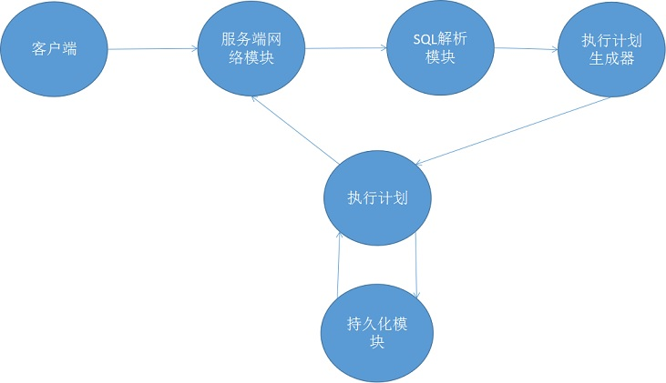
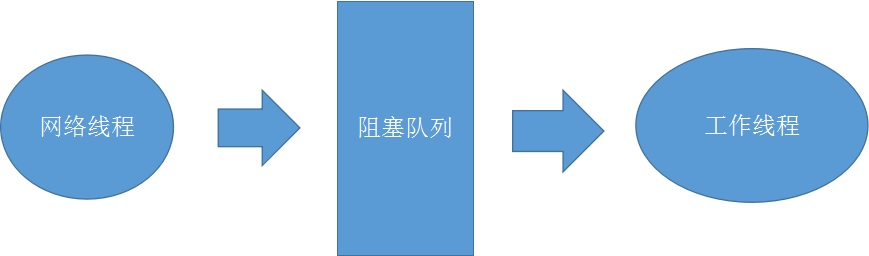
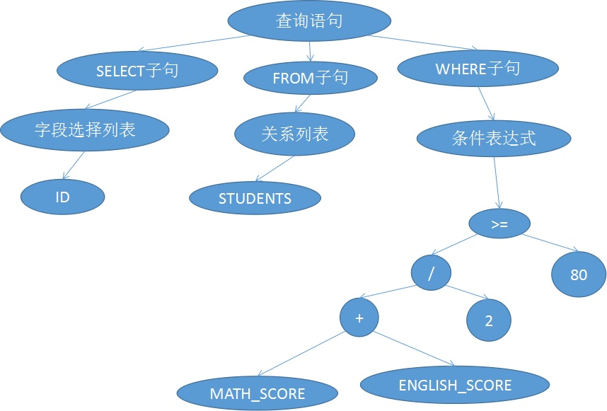
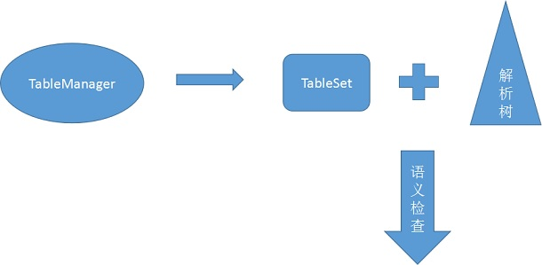
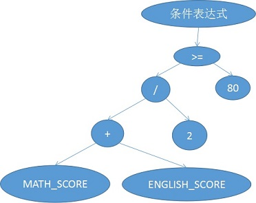
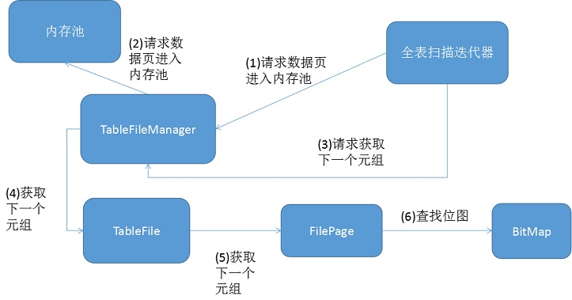

# 查询执行流程
查询执行的大致流程是客户端发送SQL到网络模块，网络模块将任务交给工作线程，工作线程先生成SQL的解析树并做语义检查，然后生成执行计划并跑执行计划，执行计划把生成的数据通过网络模块发送给客户端。
  
接下来将以查询为例，详解整个查询操作的执行过程。所用到的查询语句是SELECT ID FROM STUDENTS WHERE (MATH_SCORE + ENGLISH_SCORE) / 2 >= 80，找出所有数学英语成绩平均起来大于等于80分得学生。

## 网络部分
  
客户端把SQL语句发给服务端，服务端首先把SQL语句的字符串放入一个阻塞队列里面，工作线程会监听阻塞队列，如果队列为空则阻塞，直到队列里面有SQL字符串可以消费。接着工作线程把这条SQL语句取出。

## 生成解析树并做语义检查
接下来就是对SQL做词法分析和语法分析。词法分析得到的单词串是
Select identifier(ID) From identifier(STUDENTS) Where OpenBracket identifier(MATH_SCORE) PLUS CloseBracket DIV Integer(2) LE Integer(80)。
然后语法分析阶段把这个单词序列解析成下面的解析树。
  
接着会对解析树做语义检查。首先会从TableManager这个表管理对象中根据解析树用到的表，生成一个表信息的TableSet，接着解析树会使用TableSet的信息做语义检查。例如检查STUDENTS表是否存在，ID、MATH_SCORE、ENGLISH_SCORE这三个字段是否存在，还有后两个字段是否是可以用来做数学计算的类型。如果类型检查没通过则直接把错误消息发送给客户端。
  

## 生成执行计划
接着解析树会被用于生成执行计划。首先执行计划生成器发现是查询操作，然后就生成了一个全表扫描迭代器。接着发现解析树种含有WHERE子句，就生成一个过滤迭代器，并把全表扫描迭代器和过滤迭代器拼装在一起。接着发现SELECT子句中不是选择所有字段，接着就根据需要投影的字段生成投影迭代器，并把所有迭代器拼装成一个整体。
  

## 迭代器的运行
接着合成的三个迭代器会被运行。首先投影迭代器会被调用，然后它会去找过滤迭代器要数据，而过滤迭代器则会找全表扫描迭代器要数据。全表扫描的细节将在后面讲述，它扫到一个元组就会把它返回给过滤迭代器，过滤迭代器就做过滤操作，过滤操作会放在下节说明，如果该元组没有通过过滤，那么过滤迭代器会找全表扫描迭代器继续要数据，知道找到一个符合要求的数据为止，并把它返回给投影迭代器。投影迭代器把在得到的元组中找出ID这个字段的数据，然后把数据返回出去。
由于迭代器可以很好地做流式操作，所以迭代器生产了一部分数据的时候，就可以立刻把这部分数据通过网络发送给客户端。

## 过滤迭代器的运行
过滤迭代器的主要问题在于条件表达式的求值。
  
求值过程是从根节点递归运算，如果左右子树的值还不确定，则先计算左右子树的值。根节点计算>=运算符结果的时候，需要先计算左子树的值，以此类推，因此首先计算的是左下节点的加法，它把MATH_SCORE和ENGLISH_SCORE加起来，接着把结果返回给它的父节点，父节点把这个值除以2，接着继续返回到>=的运算符，最后算出>=的比较结果。

## 表扫描
扫描迭代器背后有非常繁重的工作。扫描迭代器首先请求把第一页的数据载入内存池，接着自身维护一个索引，不断遍历内存页中的数据，期间还要查找页中的位图表来找出下一个元组所在的位置。如果已经把内存页扫描完了，需要请求持久化层的代码把内存页释放，并请求下一页的数据放到内存池中。其中会有大量逻辑用于换页和计算元组索引，这些都是通过一层一层由外向内的对象实现的。下图以获取元组数据为例说明调用层次。
  

## 发送查询结果
由于使用了迭代器所以可以对查询得到的元组做流式处理。而数据首先写道Blastoise自建的用户态缓冲区中，并且注册可写事件，当可写事件到达时就消费用户态缓冲区的数据，直到数据消费完才注销socket可写事件监听。

## 客户端解析响应包
最后就是客户端解析响应包，把元组里面的数据解析出来。Blastoise中客户端的做法是把整个响应包接收完毕再解析里面的数据。至此，一个查询操作便完成了。
